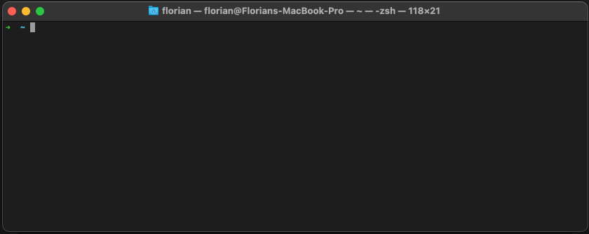

<p align="center">
  
</p>

---

[](https://img.shields.io/github/v/release/fpgmaas/skate)
[](https://github.com/fpgmaas/skate/actions/workflows/main.yml?query=branch%3Amain)
[](https://pypi.org/project/skate/)
[](https://codecov.io/gh/fpgmaas/skate)
[](https://pypistats.org/packages/skate)
[](https://img.shields.io/github/license/fpgmaas/skate)

_skate_ is a command line utility to help you organise and quickly run frequently used commands.

<p align="center">

</p>

---
<p align="center">
  <a href = "https://fpgmaas.github.io/skate">Link to documentation</a>
</p>

---

## Quickstart

### Installation

_skate_ can be installed by running

```shell
pip install skate
```

To get started, run

```shell
skate init
```

which will prompt to add a `skate/skate.yaml` file in the user's home directory for global commands, and/or a `skate.yaml` file in the current directory for commands specific to the current project. 

To use _skate_ to run any of the pre-configured commands, simply run

```
skate
```

For more information, see the [documentation](https://fpgmaas.github.io/skate/).

## Configuration

_skate_ looks for configuration in the following two locations

- From a `skate.yaml` file in the current directory
- From any `.yaml` file in the the global configuration directory, which is defaulted to `~/skate`, but which can be overridden with the environment variable `SKATE_HOME`.

An example `.yaml` file could look as follows:

```yaml
test:
  command-with-user-input:
    cmd: "echo Hello! My name is: $name. My favourite fruit is: $fruit"
    echo: false
    args:
      - name
      - fruit: apple
```

Which adds the command group `test` wth a single command.

For more details, see the [configuration](https://fpgmaas.github.io/skate/configuration) section of the documentation.

---

Repository initiated with [fpgmaas/cookiecutter-poetry](https://github.com/fpgmaas/cookiecutter-poetry).
